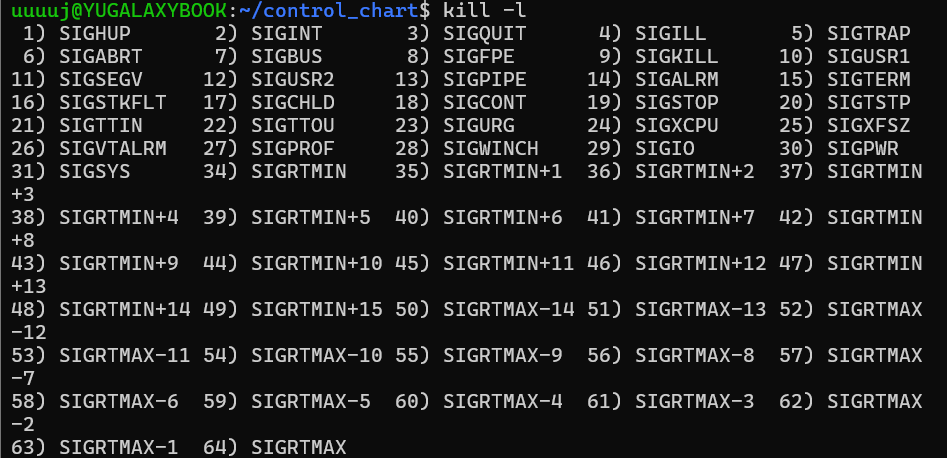

# 시스템 콜

## kill() 과 bind()
kill() : 프로세스에 "시그널"을 보내서 프로세스에 어떤 행동을 하도록 요청하는 것   
→ *"시그널" 은 어떤 형태로 프로세스에 보내지며, 어떤 과정을 거쳐 프로세스에 전해질까?*


### 주제 선정 배경

### 문제 상황!
dash 앱을 4월 21일에 배포 후, 다음 날 출근했을 때, 리눅스 터미널 세션이 닫힘(정확히 닫힌건지, dash 앱이 비정상적으로 터지면서 linux 세션까지 멈춰버린건지 가물가물함..). 

그러면서 dash 앱도 같이 배포가 종료되어, 윈도우에서 하던 것처럼 똑같이 gunicorn app:server --bind ~로 배포를 했지만 *Address already in use* 에러가 발생함. 

찾아보니 이전에 띄웠던 앱의 프로세스가 아직 살아있거나, 좀비처럼 포트를 점유하는 상황.
→*어떤 과정으로 좀비 상태가 된 걸까?*

### 좀비 프로세스 발생 시점!
죽었는데도 PID와 프로세스 정보(task_struct)는 살아 있는 상태   
이유 : 부모 프로세스가 아직 자식의 종료 상태를 읽지 않았기 때문
### Address already in use (Bind Failed) 에러란?

서버 역할을 하는 프로그램(nginx, tomcat, java(spring), python(django), nodejs 등)이 리눅스 서버 내에서 특정 IP 주소와 Port 번호를 사용하려고 할 때, bind 시스템 콜을 사용하게 됨.

그런데 이미 다른 프로세스가 해당 Port 번호를 이미 사용하고 있을 때, 포트 충돌로 인한 Bind Failed 에러가 발생할 수 있음.

[참고 링크] https://reallinux.co.kr/blog/199

### 해결 과정

먼저, 점유 중인 PID를 확인했음

*PID : Process ID, 운영체제에서 프로세스를 식별하기 위해 사용하는 고유한 번호.*   

```
sudo netstat -tnlp | grep 9000
```

그 결과 
```
tcp    0    0    0.0.0.0:9000    0.0.0.0:*    LISTEN    29346/python3
```

이렇게 떴고, 여기서 **29346**이 포트를 점유한 PID였음.

*--workers 4 이렇게 멀티 프로세스를 사용한 경우, 총 다섯개의 프로세스 목록이 뜸. 거기서 가장 위의 프로세스가 마스터 프로세스로, 마스터를 kill 하면 한꺼번에 종료 됨*

검색 결과 많은 블로그에서 이 문제 해결 방식으로 kill -9을 통해 종료시켰지만, https://reallinux.co.kr/blog/199  이 블로그에서는 그런 방식의 문제점을 지적하고 있었음

kill 9 으로 강제종료를 시키게 되면, **시스템 자원해지를 정상적으로 하지 못하고 종료가 될 수 있고, 이는 다른 부작용 발생 여지가 있다는게 문제점이었음.**

9번은 강제 종료, 15번은 일반적인 종료의 시그널임.

그래서 
```
sudo kill -15 29346 
```
이런식으로 종료해야 한다는게 글쓴이의 의견이었음.

### kill 시스템 콜

[참고 링크] https://www.joinc.co.kr/w/man/2/kill

kill() 시스템 콜은 특정 프로세스나 프로세스 그룹에 시그널을 보내기 위해서 사용한다.

```
#include <sys/types.h>

#include <signal.h>

int kill(pid_t pid, int sig);
```


kill -15 종료 로직

1. 열려 있던 파일 닫기

2. 데이터베이스 연결 끊기

3. 메모리 해제

4. 임시 파일 정리

5. 로그 남기기 등

정상적인 종료과정은 위와 같고, 자원 해제가 제대로 일어남.

하지만 kill -9의 경우, **커널이 프로세스를 즉시 종료**시키는데, 자원 해제 할 기회를 아예 갖지 못함. 
→ *커널이 프로세스를 **즉시** 종료시킨다는 것의 의미?*

메모리, 파일, 네트워크 소켓 등이 닫히지 않을 수 있음. 그 결과, 소켓이 열려있는 상태로 남아 포트를 점유하고, 임시 파일이 디스크에 그대로 남는 등의 문제가 생김

그럼에도 불구하고 kill -9 을 권유하는 글이 많은 이유는, -15로 종료시킴에도 프로세스가 무한 루프, 데드락, 응답 없음 등으로 종료되지 않는 경우가 있기 때문.​ 

### kill -9 실행 과정
kill -9 시그널이 어떤 과정을 거쳐서 프로세스를 죽일까?

1. 먼저, kill -9는 SIGKILL 이라는 시그널을 보냄. 
이때 시그널을 프로세스에 보내는 주체는 **커널**이다.

이때, 프로세스는 시그널을 **받을 수는 있지만, 처리할 수는 없다**
→ 왜냐면 받자마자 죽을 준비를 할 시간도 없이 바로 사형 당하기 때문!

> ## 시그널   
>> 커널이 프로세스에게 보내는 메세지
>> 시그널은 프로세스를 중단시키고, 삭제하는 등의 작업에 사용된다. 
>> 시그널이라는 운영체제의 메터니즘은 외부 사건을 프로세스에게 전달하는 토대이다.
>> 이 기반 구조는 시그널을 보내거나 전달받는 방법을 모두 포함한다.

다른 시스템 콜들은 시그널을 안보내나?

2. 시그널을 받으면 프로세스는 signal handler를 등록해서 내가 어떻게 반응할지 정할 수 있다.

예를 들어

```
signal(SIGTERM, my_handler)
```
이렇게 하면 SIGTERM이 왔을 때, my_handler() 함수를 실행한다.

그런데 SIGKILL(kill -9)은 특수한 시그널이라서, handler를 등록할 수 없고, 무시할 수도 없고, 수정할 수도 없다.

즉, **SIGKILL은 프로세스가 시그널을 받을 수만 있고, 그 신호에 대해 아무런 행동을 취할 수 없다.**

커널이 바로 프로세스를 죽여버리기 때문에 정리할 기회조차 주지 않음

그냥 갑자기 길가다가 핵 폭탄 맞고 증발하는 것과 비슷한듯;죽을 준비도 못하고 죽어버림.

[사용자 공간] → kill(pid, SIGKILL) 호출 → [커널 공간으로 시스템 콜 진입] → 커널이 해당 PID의 프로세스 찾아서 → 프로세스에게 SIGKILL 플래그 설정 → 커널이 직접 프로세스를 강제 제거 (종료 상태로 만듦)

### 정리 못하고 죽어버리는 작업의 위험성이 있을까? kill -15를 안쓰고, kill -9를 많이 쓰는 이유는?


