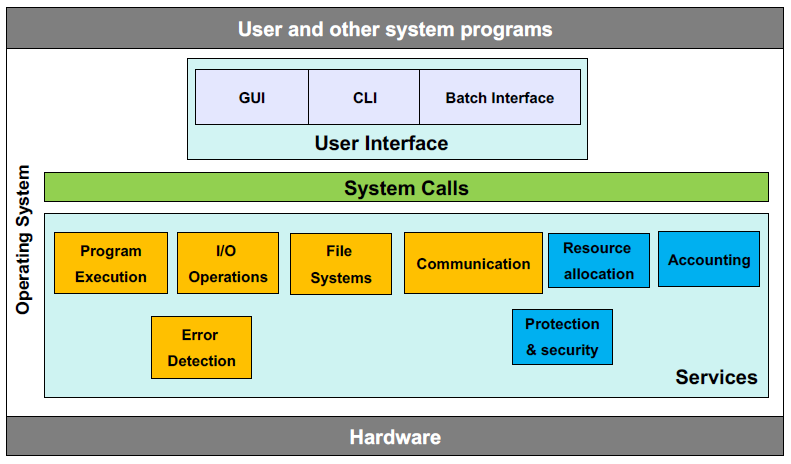

> # System Call ?
> 출처 : 운영체제 아주 쉬운 세 가지 이야기
--- 
 

# 시스템 콜이 무엇인가 ?
시스템 콜(System Call)은 운영체제의 커널이 제공하는 기능에 접근하기 위한 프로그래밍 인터페이스(=함수)다. 사용자 프로그램이 직접 하드웨어 자원에 접근하는 것은 보안과 안정성이 확보되지 않아 위험하기에, 운영체제가 이러한 자원에 대한 접근을 직접 관리하게 된다.

**즉, 시스템 콜은 사용자 공간과 커널 공간을 잇는 다리다.**

 

# 시스템 콜이 동작하는 방식
### 1. 트랩 매커니즘 발생
사용자 프로그램이 시스템 콜을 호출한다면 CPU는 현재 실행 중인 프로세스의 상태를 저장하고 커널의 특정 부분으로 제어를 넘기게 된다.

### 2. 시스템 콜 번호 확인
시스템 콜은 고유한 번호를 가지고 있고 시스템 콜이 호출 될 때, CPU의 특정 레지스터에 저장하여 커널에게 어떤 시스템 콜을 호출했는지 알려준다.

### 3. 매개변수 전달
CPU 레지스터에 직접 저장, 메모리 주소 등의 방법으로 시스템 콜에 필요한 매개변수를 전달한다.

### 4. 시스템 콜 테이블 확인
커널 내부에는 시스템 콜 번호와 함수의 주소를 매핑하는 시스템 콜 테이블이 존재한다. 커널은 테이블을 확인하고 적절한 함수를 실행한다.

### 5. 모드 전환
시스템 콜 처리 과정에서는 사용자 모드 -> 커널 모드로의 전환이 발생한다. 이 과정에서 CPU 레지스터 상태, 프로그램 카운터 등의 정보가 저장되고 복원되는 컨텍스트 스위칭도 함께 일어나게 된다.

 

# 시스템 콜 VS 라이브러리 함수
일반적으로 시스템 콜과 라이브러리 함수를 혼동하기 쉽다. 하지만, 이를 구분하는 것은 제공하는 주체를 파악해야 한다.

일반적으로 라이브러리 함수는 특정 라이브러리에서 제공된다. 이러한 함수들 중에서 커널의 기능이 필요한 함수는, 이미 내부적으로 OS에서 제공하는 시스템 콜을 랩핑한 것과 동일하다.

 

# 비용이 많이 드는 컨텍스트 스위칭
시스템 콜은 사용자<->커널 모드 전환이 필요하기 때문에 컨텍스트 스위칭이 발생한다. 이 행위에는 많은 오버헤드를 일으키게 되고 성능이 중요한 프로그램에서는 시스템 콜 사용을 최적화 하는 것이 중요하다.

## 시스템 콜의 최적화 방법들
1. 배치 처리
   - 여러 개의 작은 I/O 요청 대신, 큰 버퍼를 사용해서 한 번에 많은 데이터를 Read/Write 하는 방식으로 시스템 콜의 호출 수를 줄일 수 있다.

2. 시스템 콜 캐싱
   - 자주 사용되는 시스템 콜은 결과를 캐싱하여 불필요한 시스템 콜을 줄일 수 있다.

 

