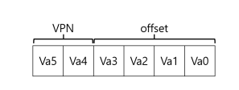
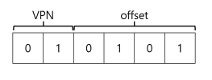
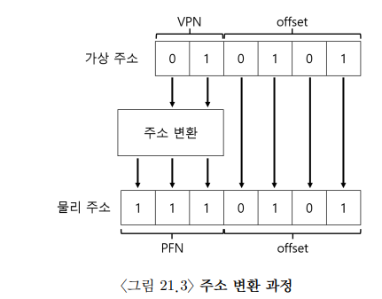

# OSTEP Paging

페이지 : 프로세스의 주소 공간을 몇개의 가변 크기의 논리 세그멘트(코드, 힙, 스택)로 나누는 것이 아니라, 고정 크기의 단위로 나눈다. 이 각각의 고정 크기 단위를 **페이지**라고 부른다.

페이징 : 공간을 동일 크기의 조각으로 분할하는 것을 가상 메모리에서 페이징이라고 한다.

페이지 프레임 : 실제 물리 메모리(RAM)의 작은 고정 크기의 블록들이 쭉 나열된 배열

### 페이징의 장점

1. 페이징을 사용하면 프로세스의 주소 공간 사용 방식과는 상관 없이 효율적으로 주소 공간 개념을 지원할 수 있다. 예를 들어, 힙과 스택이 어느 방향으로 커지는가, 어떻게 사용되는가에 대한 가정을 하지 않아도 된다.

이게 무슨 말인가

페이징은 가상 주소 공간을 페이지 단위로 나누고, 물리 메모리에 원하는 위치에 배치할 수 있도록 한다.

덕분에 운영체제는 주소 공간이 실제로 어떻게 배치되는지 신경쓰지 않아도 되고, 단순히 필요한 만큼의 페이지를 메모리에 매핑함으로써 유연하고 효율적으로 메모리를 관리할 수 있다는 의미이다.

2. 페이징이 제공하는 빈 공간 관리의 단순함.

운영체제가 64바이트 주소 공간을 8페이지 물리 메모리에 배치하기를 원한다고 할때, 운영체제는 비어 있는 네 개의 페이지만 찾으면 된다. 

아마 이를 위해 운영체제는 모든 비어 있는 페이지의 빈 공간 리스트를 유지하고 리스트의 첫 네 개 페이지를 선택할 것이다.

### 페이지 테이블

주소 공간의 각 가상 페이지에 대한 물리 메모리 위치 기록을 위해 운영체제가 프로세스마다 가지고 있는 자료 구조이다. 

* 페이지 테이블 주요 역할   
주소 공간의 가상 페이지 주소 변환 정보를 저장하는 것. 각 페이지가 저장된 물리 메모리 위치가 어디인지 알려준다.

각각의 프로세스는 자신만의 페이지 테이블을 독립적으로 가지고 있으며, 각 페이지 테이블 원소 하나하나를 page table entry(pte)라고 한다.(PintOS에서 본 것 같기도 하고...)

### 제목을 뭐라고 해야하지

프로세스가 생성한 가상 주소의 변환을 위해 먼저 가상 주소를 가상 페이지 번호(virtual page number, VPN)와 페이 내의 오프셋 2개의 구성 요소로 분할한다.

가상 주소 공간의 크기가 64바이트이기 때문에 가상 주소는 6비트가 필요하다(2^6 = 64)

> **이건 무슨 말일까?**   
> 가상 주소 공간이 64비트 : 프로세스가 사용할 수 있는 가상 메모리 범위가 64개의 연속된 주소라는 뜻   
>이 주소들을 2진수로 표현하기 위해 필요한 비트 수 : 2^6 = 64, 6비트로 표현할 수 있는 주소 범위는 0~63(총 64개) 이므로, **가상 주소 하나를 표현하려면 6비트가 필요하다**는 뜻.

페이지 크기는 64바이트의 주소 공간에서 16바이트이다. 따라서 4페이지를 선택할 수 있어야 하고, 따라서 주소의 최상위 2비트가 그 역할을 한다.

>페이지 크기 : 16바이트
>64바이트 / 16바이트 = 4

우리는 2비트 가상 페이지 번호(VPN)를 가지게 된다. 나머지 비트는 페이지 내에서 우리가 원하는 바이트의 위치를 나타낸다. 이것을 오프셋이라고 부른다.

프로세스가 가상 주소를 생성하면 운영체제와 하드웨어가 의미있는 물리 주소로 변환한다. 
예를 들어, 가상 주소가 21이라고 하자.

이걸 이진 형식으로 표현하면 010101을 얻고, 이 가상 주소를 검사하고 가상 페이지 번호와 오프셋으로 나눈다.

>가상 주소를 검사한다는 의미는 무엇일까?
>...모르겠다.

>오프셋의 역할은?
>해당 가상 페이지 안에서 정확히 어느 바이트를 가리키는지 알려주는 값
>VPN(상위 2비트) : 01 → 가상 페이지 1번
>offset(하위 4비트) : 0101 → 페이지 안에서 5번째 바이트
>가상 페이지 1번의 5번째 바이트를 읽고 싶은 것

이 가상 페이지 번호를 통해, 페이지 테이블의 인덱스로 사용하여 가상 페이지 1이 어느 물리 프레임에 저장되어 있는지 찾을 수 있다.

물리 프레임 번호(physical frame number, PFN)이 7일때, VPN은 PFN으로 교체하여 가상 주소를 변환 할 수 있다. 그런 후에 물리 메모리에 탑재 명령어를 실행한다.

오프셋은 페이지 내에서 어느 바이트를 가리키는지 알려주기 때문에 변환되지 않는다.

### 물리 메모리 크기의 극복(feat.스왑)

큰 주소 공간을 지원하기 위해 운영체제는 현재는 크게 필요하지 않은 일부를 보관해둘 공간이 필요하다. 일반적으로 그 공간은 메모리 공간보다 더 크며, 더 느리다. 
현재 시스템에서는 보통 하드 디스크 드라이브가 이 역할을 담당한다.

>프로세스에게 큰 주소 공간을 제공해야 하는 이유?
>주소 공간이 크면, 프로그램의 자료 구조들을 위한 충분한 메모리 공간이 있는지 걱정하지 않아도 된다.
>멀티프로그래밍과 사용 편의성 등의 이유로 실제 물리 메모리보다 더 많은 용량의 메모리가 필요하게 되었다.

>저장 장치 기술에는 여러가지가 있다.
>플래시 기반의 SSD일 수도 있다.

스왑 공간이 추가되면, 운영체제는 실행되는 각 프로세스들에게 큰 가상 메모리가 있는 것 같은 환상을 줄 수 있다.

### 스왑 공간

* 디스크에 페이지들을 저장할 수 있는 일정 공간을 말한다.   

>swap out : 메모리 페이지를 읽어서 이곳에 쓴다.
>swap in : 디스크에서 페이지를 읽어 메모리에 탑재시킨다.
>*스왑 공간의 입출력 단위는 페이지라 가정한다*

위 그림에서 proc 3(프로세스 3)은 현재 실행중인 프로세스가 아니며, 만약 이 프로세스가 실행되면 각 페이지들은 메모리로 탑재된다. 

한번에 모두 탑재될 수도 있고, 필요 시 한 페이지씩 탑재할 수도 있다.

### 메모리에 빈 공간이 없는 경우

메모리에 빈 공간이 없는 경우, 공간 확보를 위해 하나 또는 그 이상의 페이지들을 먼저 페이지 아웃할 수도 있다. 교체하려는 행위인데, 교체 페이지를 선택하는 것을 페이지 교체 정책이라고 한다.

잘못된 페이지 교체 정책을 선택할 경우, 메모리 속도로 동작하는 것이 아니라, 디스크와 비슷한 속도로 동작할 수도 있다.

하지만 이 방법은 그리 효율적이지 않다. 

운영체제는 항상 어느 정도의 여유 메모리 공간을 확보하고 있어야 한다.

운영체제가 여유 공간의 크기가 최솟값보다 작아지면 여유 공간 확보를 담당하는 백그라운드 스레드가 실행된다. 이 스레드는 여유 공간의 크기가 최댓값에 이를 때까지 페이지를 제거한다. 이 백그라운드 스레드는 일반적으로 스왑 데몬, 또는 페이지 데몬이라고 불린다. 충분한 여유 메모리가 확보되면 이 백그라운드 스레드는 슬립모드로 들어간다.

메모리에 빈 공간이 없는 경우엔 그냥 하드웨어 업그레드를 하는 것은 어떨까?
돈이 최고다.

