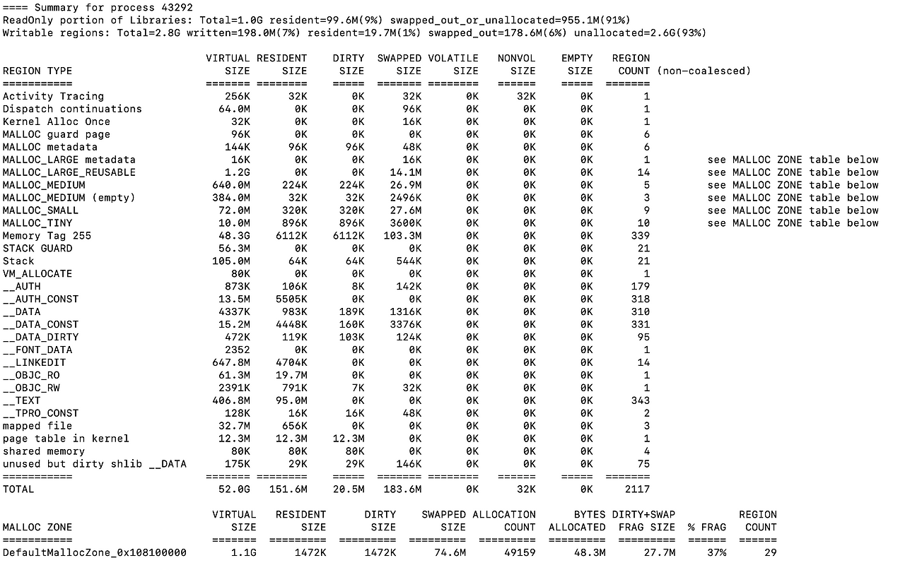

## **들어가며 - 단순한 웹앱 뒤에 숨어 있던 복잡한 구조**

이번 주 CS 스터디 주제는 ‘가상 메모리와 페이징’이었다. 교과서처럼 정리된 개념도 중요하지만, 나는 실전에서 어떻게 쓰이는지가 궁금했다. 그러다 문득 이런 의문이 들었다.

> 내 웹앱은 그냥 버튼을 눌러 GPT API를 호출하고 결과를 보여줄 뿐인데…  
> 이 간단한 작업에도 운영체제는 뭔가 거대한 걸 하고 있지 않을까?

그래서 이번 글에선 내가 직접 만든 사주 웹앱을 출발점으로 삼아, 운영체제 안에서 실제로 어떤 일이 벌어지는지—특히 가상 메모리와 페이징 구조가 어떻게 작동하는지를 하나씩 살펴본다.


## **버튼 한 번 눌렀는데, 메모리가 열린다고요?** 

웹앱 사용자 입장에선 “버튼 누르기 → 결과 확인”이 전부지만, 서버 입장에선 그 순간 하나의 요청을 처리하는 작은 프로세스가 생성된다. 이때 운영체제가 제일 먼저 해주는 일은 해당 요청을 위한 ‘공간’을 마련하는 일이다. 하지만 그 공간은 RAM(물리 메모리)이 아니다. 운영체제가 만들어주는 가상 메모리(Virtual Memory) 다.

> **💡 가상 메모리란?**  
> \- 프로그램마다 독립적인 메모리 공간을 가진 것처럼 보이게 한다.  
> \- 다른 프로그램의 메모리 공간을 침범하지 못하게 격리한다.  
> \- 실제로는 물리 메모리보다 더 큰 공간처럼 보이게도 할 수 있다.

즉, 운영체제는 각 프로그램에게 “네 것처럼 보이는” 메모리를 나눠주는 스마트한 착시 트릭을 쓰는 셈이다.

### **실습: 단 하나의 요청으로 움직인 500MB**

내 웹앱은 Node.js 기반으로 돌아간다. 버튼을 눌러 사주를 입력하면, 백엔드에서 GPT API를 호출해 결과를 받아온다. 이 과정에서 프로세스가 사용하는 메모리를 확인해봤다. 

```
console.log('💾 메모리 사용량 (요청 직후):', process.memoryUsage());
```

```
💾 메모리 사용량 (요청 직후): {
  rss: 165691392,
  heapTotal: 133857280,
  heapUsed: 119901784,
  external: 366970710,
  arrayBuffers: 362820946
}
```

**로그 해석** (ChatGPT 선생에게 부탁했다.) 

| **항목** | **의미** | **단위 변환(MB)** |
| --- | --- | --- |
| rss | Resident Set Size. 이 프로세스가 실제 물리 메모리(RAM)에서 차지한 전체 공간. | 약 158 MB |
| heapTotal | JS 힙에서 확보한 메모리 총량 | 약 127.6 MB |
| heapUsed | 실제 사용 중인 JS 힙 메모리 양 | 약 114.3 MB |
| external | C++ 기반 바인딩이나 버퍼, fetch 응답 등 JS 외부에서 사용하는 메모리 | 약 350 MB |
| arrayBuffers | external 중에서 ArrayBuffer 객체가 사용하는 메모리 | 약 345.9 MB |

실제로 process.memoryUsage()를 찍어봤더니, 단 하나의 사주 요청에도 500MB가 넘는 메모리가 움직이고 있었다. 특히 눈에 띄는 건 external 메모리 사용량이었다. GPT 응답을 받아 파싱하거나, 문자열 버퍼링 등을 처리하면서 상당한 메모리가 사용된 것을 볼 수 있다.

### **요청 후 메모리는 줄었다? 예상 밖의 결과**

GPT 응답을 받고 난 직후의 메모리 상태도 확인해봤다.

```
console.log('💾 메모리 사용량 (GPT 응답 후):', process.memoryUsage());
```

```
💾 메모리 사용량 (요청 직후): {
  rss: 154976256,
  heapTotal: 121208832,
  heapUsed: 115055504,
  external: 157150237,
  arrayBuffers: 153000433
}

💾 메모리 사용량 (GPT 응답 후): {
  rss: 76021760,
  heapTotal: 121208832,
  heapUsed: 115885144,
  external: 157190280,
  arrayBuffers: 153037072
}
```

요청 전후 메모리 비교

| **항목** | **요청 직후** | **GPT 응답 후** | **변화량** |
| --- | --- | --- | --- |
| rss | 154,976,256 (약 147.8MB) | 76,021,760 (약 72.5MB) | ▼ 약 75.3MB 감소 |
| heapUsed | 115,055,504 | 115,885,144 | ▲ 약 829KB 증가 |
| external | 157,150,237 | 157,190,280 | ▲ 약 40KB 증가 |
| arrayBuffers | 153,000,433 | 153,037,072 | ▲ 약 36KB 증가 |

  
요청 직후 메모리는 약 148MB였지만, GPT 응답을 받은 뒤엔 오히려 72MB로 줄었다. 응답을 받으며 버퍼가 늘어난 건 사실이지만, 운영체제는 그 과정에서 일부 메모리를 정리하거나 재정렬한 것으로 보인다. 단순히 “요청하면 메모리가 늘어난다”는 예상을 깨는 결과였다. 가상 메모리 위에서 메모리는 단순한 증가나 감소가 아니라, 더 유연하게 움직이고 있었다. 


## **가상 주소는 진짜 주소가 아니다? 그럼 어떻게?**

그런데 한 가지 궁금증이 생겼다. 메모리 사용량은 알겠는데, 이 메모리는 실제로 어디서 온 걸까? 우리가 코드를 실행할 때 사용하는 주소는 ‘가상 주소’라는데, 그게 진짜 물리 메모리(RAM)랑는 어떻게 연결되는 걸까?

> “그럼 이 가상 주소들은 실제 RAM 어딘가로 어떻게 연결되는 걸까?”

이때 사용되는 핵심 개념이 바로 페이징(Paging) 이다.

> ****💡** 페이징의 원리**  
> \- 가상 메모리는 일정한 크기(보통 4KB)의 페이지(Page) 로 나뉜다.  
> \- 물리 메모리도 동일한 크기의 프레임(Frame) 으로 나뉜다.  
> \- 운영체제는 페이지와 프레임을 1:1로 매핑하는 테이블을 관리한다.

즉, 가상 주소를 통해 실제 물리 주소를 찾아가는 역할을 하는 것이 페이지 테이블(Page Table) 이다.

### **운영체제가 메모리를 나누는 방식, 직접 확인해봤다**

Node.js 서버가 사용하는 실제 메모리 맵을 vmmap 명령어로 확인해봤다.

```
ps aux | grep "gpt-saju-app"
lsof -i :3000
vmmap <PID>
```

다음과 같이 엄청나게 긴 내용이 나온다. 나는 해석할 수 없어서 ChatGPT 선생에게 부탁했다. 



#### **Node.js 실행 파일이 메모리에 올라간 구간**

```
__TEXT  1045d0000-106924000  [ 35.3M  2480K  0K  0K] r-x/r-x SM=COW  /opt/homebrew/Cellar/node/23.11.0/bin/node
```

Node.js 실행 바이너리 자체가 메모리의 특정 구간에 올라가 있는 걸 확인할 수 있다. 이 영역은 읽기 전용이며, 복사-쓰기(COW) 방식으로 관리된다. 내가 직접 만든 코드가 실행되기 전, Node 런타임 환경이 먼저 메모리에 자리 잡는다.

#### **MALLOC (동적 메모리 할당) 영역**

```
MALLOC metadata  600000000-600040000  [  256K  64K  64K  0K] rw-/rw- SM=PRV
MALLOC (heap)    600040000-601800000  [ 24.5M  22.3M 22.3M  0K] rw-/rw- SM=PRV
```

힙(heap) 메모리는 MALLOC으로 할당된다. 실제로 사주 웹앱에서 API 요청을 처리하고, GPT 응답을 받아 파싱하는 대부분의 동적 데이터는 이 영역을 통해 관리된다. 24.5MB 중 22.3MB가 실제로 쓰이고 있었다.

#### **STACK 및 STACK GUARD (스레드 스택과 보호 영역)**

```
STACK GUARD  7000022d0000-700002ad0000  [ 128.0M    0K    0K  0K] ---/rwx SM=NUL  stack guard for thread 0
Stack         700002ad0000-700002b50000  [  512K  84K  84K  0K] rw-/rwx SM=ZER  thread 0
```

각 스레드는 자체적인 스택 공간을 가진다. 스택 앞뒤에는 보호용 guard 영역이 존재하는데, 이는 오버플로우(버퍼 침범) 등을 막기 위한 것이다. 실제 함수 호출, 지역 변수는 이 Stack 영역에서 다뤄진다.

#### **JIT-compiled code와 캐시된 JS 코드**

```
__LINKEDIT     106920000-106960000  [  256K   20K   20K  0K] r--/r-- SM=COW  /opt/homebrew/Cellar/node/23.11.0/bin/node
...
__DATA_CONST   1068e8000-1068e9000  [    4K    4K    0K  0K] r--/rw- SM=PRV
```

Node.js가 실행 중에 동적으로 생성하는 코드와 캐시도 가상 주소 공간 안에 따로 자리 잡는다. 이는 자바스크립트가 인터프리터가 아니라 JIT(Just-In-Time) 컴파일을 수행하기 때문이며, 우리가 보지 못하는 최적화가 이 영역에서 일어난다.


## **보이지 않는 최적화의 계층을 알게 되다**

사주 웹앱처럼 단순해 보이는 서비스조차도, 그 이면에는 수많은 운영체제의 장치가 정교하게 작동하고 있다. 가상 메모리는 그중에서도 핵심적인 개념이다. 단순히 “메모리를 많이 쓰게 해주는 기술”이 아니라, 코드의 안정성, 프로그램 간의 격리, 시스템 자원의 효율적 분배를 가능하게 하는 토대다.  
  
그리고 이 가상 메모리는 페이징이라는 메커니즘을 통해 물리 메모리와 연결된다. 우리가 작성한 코드 한 줄도 결국은 4KB짜리 페이지 단위로 나뉘어, 그때그때 필요한 만큼만 물리 메모리에 올라온다. 이처럼 보이지 않는 최적화의 계층 덕분에, 우리는 큰 비용 없이 여러 요청을 동시에 처리할 수 있고, 수백 개의 프로세스가 공존하는 시스템을 구축할 수 있다.


## **마무리 – 그냥 돌아가는 줄 알았던 내 코드 뒤에서**

처음에는 ‘가상 메모리’나 ‘페이징’ 같은 말이 너무 추상적으로 느껴졌다. 운영체제 수업이나 블로그 글을 봐도, 그냥 어려운 개념 같고 ‘이걸 알아서 내가 뭘 하지?’ 싶은 마음이 컸죠. 그런데 내가 만든 사주 웹앱을 기준으로 하나씩 들여다보니, “아… 내가 단순히 API 한 번 호출하는 것도, 운영체제 입장에선 되게 세심하게 관리하고 있었구나.” 하는 생각이 들었다.   
  
버튼 한 번 눌렀을 뿐인데, 운영체제는 그걸 위해 공간을 마련하고, 필요한 데이터만 쏙쏙 꺼내오고, 안 쓰는 메모리는 치우고… 마치 정말 잘 훈련된 비서처럼 일하고 있었다. 

운영체제를 공부하면 늘 드는 생각이 있다. “내가 모르는 사이에 운영체제가 엄청 많은 걸 해주고 있었구나.” 처음엔 그냥 Node.js로 코딩하고, GPT API 호출해서 결과만 보면 된다고 생각했다. 근데 그 과정 하나하나에 운영체제가 얼마나 섬세하게 관여하고 있는지를 알고 나니까, 내가 짠 코드가 좀 더 다르게 보이기 시작했다. 

아직도 완전히 이해한 건 아니지만, 앞으로는 코드가 느려지거나 서버가 터질 때, 그냥 ‘왜 이러지?’ 하고 막막해하기보다 운영체제가 뭘 하고 있었는지를 먼저 떠올릴 수 있을 것 같다. 이해보다 관심이 먼저라는 걸 느꼈고, 그 관심이 나를 조금 더 좋은 개발자로 만들어줄 것 같다. 


**\[ 도움 받았던 자료 \]**

-   Node.js 공식 문서: [process.memoryUsage()](https://nodejs.org/api/process.html#processmemoryusage)
-   Apple Developer Docs: [vmmap 명령어](https://developer.apple.com/library/archive/documentation/Darwin/Reference/ManPages/man1/vmmap.1.html)
-   OSTEP: [Operating Systems: Three Easy Pieces](http://pages.cs.wisc.edu/~remzi/OSTEP/)